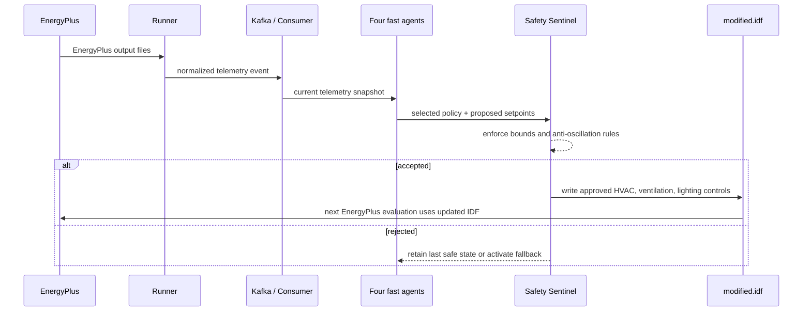

# AABOS — Autonomous Adaptive Building Operating System

> A safe, closed-loop building controller that combines an EnergyPlus digital twin, Kafka telemetry, four specialized agents, a local open-source LLM, MCP tool calling, and deterministic safety controls.

AABOS turns a building model into an operating feedback loop: it observes EnergyPlus telemetry, selects a policy, validates the resulting controls, writes a runtime `modified.idf`, measures the next EnergyPlus result, and self-corrects when comfort outcomes are poor.

## Why AABOS

Conventional BMS schedules cannot react well to changing demand, occupancy, or comfort conditions. AABOS separates **fast, deterministic building safety** from **slower strategic AI reasoning**:

- Every simulation cycle is evaluated by specialized control agents and protected by a Safety Sentinel.
- Local Llama 3.2 is invoked only for a meaningful event, a new goal, or a periodic strategic review.
- The LLM never controls equipment directly. It can only recommend a named operating policy through governed MCP tools.

This gives the project both autonomy and an explicit safety boundary.

## Judge quick view

| Requirement | AABOS evidence |
| --- | --- |
| Physics-based simulator | Real EnergyPlus subprocess wrapper reads zone temperature, humidity, occupancy, and power. |
| Closed-loop control | Safety-approved controls are written into [`energyplus/generated/modified.idf`](energyplus/generated/modified.idf) before the next EnergyPlus evaluation. |
| Open-source LLM | Local `llama3.2:3b` runs through Ollama for strategic policy reasoning. |
| MCP/tool calling | Llama must call `inspect_building_runtime`; dashboard records `inspect_building_runtime` and `queue_policy_recommendation`. |
| Energy + comfort | Dashboard compares measured EnergyPlus power against a balanced baseline while enforcing a 20–24 °C occupied comfort band. |
| Self-correction | A comfort shortfall records a failed policy and activates a Safety Sentinel-governed fallback. |

## Architecture

```mermaid
flowchart LR
    EP["EnergyPlus digital twin"] -->|"zone telemetry"| Runner["EnergyPlus runner"]
    Runner -->|"normalized event"| Kafka[("Kafka: aabos.telemetry")]
    Kafka --> Consumer["Telemetry consumer"]
    Consumer --> State["Shared building state"]
    State --> Window["Bounded sliding-window aggregator"]
    State --> Fast["Fast control loop"]
    Fast --> Agents["Comfort · Energy · Occupancy · Carbon agents"]
    Agents --> Decision["Decision Engine"]
    Decision --> Sentinel["Safety Sentinel"]
    Sentinel --> Gateway["Single control gateway"]
    Gateway --> IDF["Runtime IDF writer"]
    IDF --> Generated["generated/modified.idf"]
    Generated --> EP

    State --> Dashboard["FastAPI + React dashboard"]
    Window --> Events["AGMS events / operator goals"]
    Events --> Worker["Asynchronous strategic worker"]
    Worker --> LLM["Local Llama 3.2 via Ollama"]
    LLM <-->|"read-only governed tools"| MCP["FastMCP server"]
    MCP --> Handoff["Queue policy recommendation"]
    Handoff --> Sentinel
```



### Data flow in one control cycle



## Two-horizon autonomy

### Fast control horizon — every EnergyPlus cycle

The fast path is deterministic and does not wait for LLM output, database writes, or network calls.

| Agent | Responsibility |
| --- | --- |
| Comfort Agent | Evaluates temperature and humidity against occupied comfort constraints. |
| Energy Agent | Detects high power demand and favors energy-saving operation. |
| Occupancy Agent | Adapts operation to low or high occupancy. |
| Carbon Agent | Considers power demand with available carbon-intensity context. |

The Decision Engine arbitrates their scored recommendations. The Safety Sentinel is the final authority for HVAC temperature, ventilation, lighting, maximum step sizes, and reversal prevention.

### Strategic horizon — event-driven LLM reasoning

The Goal Management System (AGMS) queues a strategic review when meaningful conditions occur, including a power spike, occupancy transition, comfort degradation, or a new human goal. It also supports periodic strategic reviews.

The local LLM runs on a background worker. This is deliberate: the building keeps operating safely even while Llama is reasoning or unavailable.

## MCP and LLM guardrails

The FastMCP server exposes the following controlled context:

- Resources: `building://telemetry/current` and `building://setpoints/current`.
- Inspection tools: `get_building_context`, `inspect_generated_model`, `read_energyplus_runtime_errors`, and composite `inspect_building_runtime`.
- Governed handoff: `queue_policy_recommendation`.
- Safety-gated actuator interfaces: HVAC, ventilation, and lighting setpoint tools.

The Ollama prompt requires `inspect_building_runtime` before a policy can be returned. The tool provides live building context, generated-IDF evidence, and a bounded EnergyPlus error-log tail. The final model response is schema-constrained JSON containing only a policy (`balanced`, `energy_saver`, `comfort_first`, or `carbon_aware`) and a short rationale.

An LLM recommendation is never an actuator command:

```text
LLM policy → MCP policy queue → next control cycle → Safety Sentinel
→ approved setpoints → modified.idf → next EnergyPlus evaluation
```

If a proposal exceeds a safety step or creates an unsafe reversal, the Sentinel rejects it and retains the last safe state or applies a safe fallback.

## Prompt-latency and simulation-log management

EnergyPlus files are intentionally not passed verbatim to the LLM.

- Kafka telemetry is reduced to a bounded sliding window: average/min/max temperature, humidity, occupancy, average/peak power, and estimated energy.
- The composite MCP inspection tool limits runtime-error evidence to a short tail.
- Ollama is warmed asynchronously at startup, retained for 30 minutes, limited to a 2,048-token context and 120 generated tokens.
- The strategic worker has a deterministic fallback if the local LLM is unavailable.

This prevents long simulation logs or LLM response time from pausing the real-time control loop.

## Runtime building models and measured outcomes

- [`energyplus/baseline.idf`](energyplus/baseline.idf) is the source building model.
- [`energyplus/generated/modified.idf`](energyplus/generated/modified.idf) is generated at runtime and contains the current approved setpoints.
- The dashboard records baseline and actual EnergyPlus energy accumulation. Counterfactual comparisons are advisory only; realized savings always come from measured EnergyPlus output.

In a verified comparison at the same occupied simulated period, the baseline measured **22.04 kW** and Energy Saver measured **17.50 kW**, a **20.6% reduction** while the selected temperature remained in the occupied comfort band.

## Repository layout

```text
app/
  agents/                 Four specialized fast-loop agents
  api/routes/             FastAPI endpoints and WebSocket telemetry stream
  mcp/server.py           FastMCP resources and governed tools
  services/               Decision Engine, Safety Sentinel, AGMS, LLM worker, memory
  simulation/             EnergyPlus runner and runtime IDF writer
energyplus/
  baseline.idf            Immutable baseline model
  generated/modified.idf  Runtime-generated control model
frontend/                 React + Vite monitoring dashboard
tests/                    Unit and closed-loop behavior tests
docker-compose.yml        Kafka, ZooKeeper, PostgreSQL services
```

## Quick start

### Prerequisites

- macOS, Linux, or Windows with Docker Desktop
- Python 3.11+
- Node.js 18+
- EnergyPlus 26.1 or compatible EnergyPlus installation
- [Ollama](https://ollama.com/) with `llama3.2:3b`

### 1. Clone and install dependencies

```bash
git clone <YOUR_REPOSITORY_URL>
cd Honeywell_Hackathon

python3 -m venv .venv
source .venv/bin/activate              # Windows PowerShell: .venv\Scripts\Activate.ps1
pip install -r requirements.txt

cd frontend
npm install
cd ..

cp .env.example .env
```

### 2. Start infrastructure and local model

```bash
docker compose up -d
ollama pull llama3.2:3b
ollama list
```

If `ollama list` does not work, start the local Ollama server in a separate terminal:

```bash
ollama serve
```

### 3. Configure EnergyPlus paths

Set the three paths below for your EnergyPlus installation. The example is the verified macOS setup used for this project.

```bash
export ENERGYPLUS_EXECUTABLE=/usr/local/bin/energyplus
export ENERGYPLUS_IDF_PATH=/Applications/EnergyPlus-26-1-0/ExampleFiles/RefBldgSmallOfficeNew2004_Chicago.idf
export ENERGYPLUS_WEATHER_PATH=/Applications/EnergyPlus-26-1-0/WeatherData/USA_IL_Chicago-OHare.Intl.AP.725300_TMY3.epw
```

### 4. Start the backend

```bash
SIMULATION_ENABLED=true \
SIMULATION_INTERVAL_SECONDS=12 \
LLM_ENABLED=true \
LLM_MODEL=llama3.2:3b \
ENERGYPLUS_EXECUTABLE="$ENERGYPLUS_EXECUTABLE" \
ENERGYPLUS_IDF_PATH="$ENERGYPLUS_IDF_PATH" \
ENERGYPLUS_WEATHER_PATH="$ENERGYPLUS_WEATHER_PATH" \
ENERGYPLUS_OUTPUT_DIR=var/energyplus \
.venv/bin/uvicorn app.main:app --host 127.0.0.1 --port 8000
```

### 5. Start the dashboard

Open a second terminal:

```bash
cd Honeywell_Hackathon/frontend
npm run dev
```

Open [http://localhost:5173](http://localhost:5173). Wait for two or three cycles before evaluating savings.

### Optional: expose the MCP server to an external MCP client

```bash
.venv/bin/python -m app.mcp.server
```

## Demo checklist

1. Show live EnergyPlus telemetry, changing `Last update`, and increasing autonomous cycles.
2. Show four-agent arbitration and the Safety Sentinel-approved active setpoints.
3. Show measured baseline-versus-actual savings and comfort status.
4. Use **Refine with local LLM** and show the MCP tool audit.
5. From the repository root, prove generated-IDF injection:

   ```bash
   head -2 energyplus/generated/modified.idf
   ```

6. Demonstrate the Self-Healing Loop using expected comfort `95` and actual comfort `89`.

## Verification

```bash
.venv/bin/pytest -q
cd frontend && npm run build
```

## Scope note

AABOS does not train a custom foundation model. It uses a local pretrained open-source LLM for strategic reasoning and combines it with reward-guided Automation Memory / Adaptive Policy Evolution for bounded online policy adaptation. EnergyPlus remains the source of truth for building physics and measured energy outcomes.
