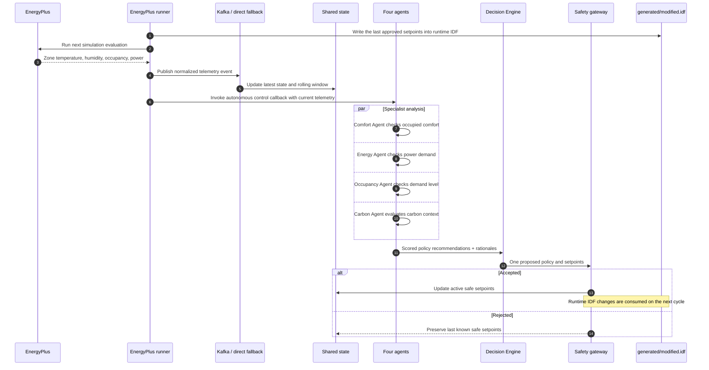
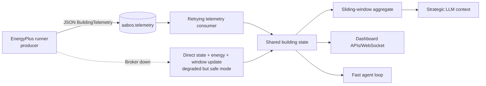
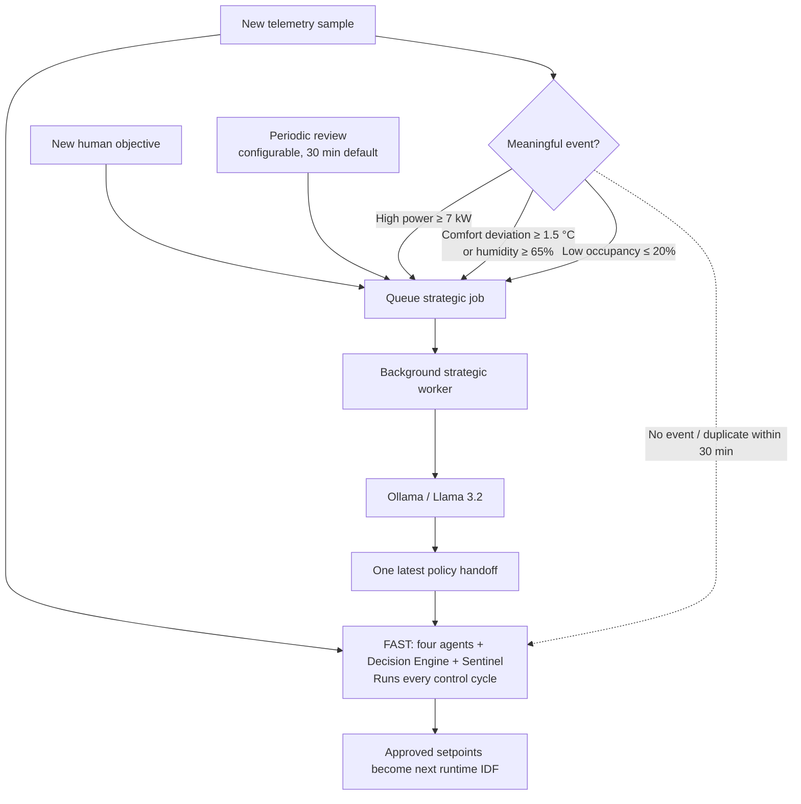
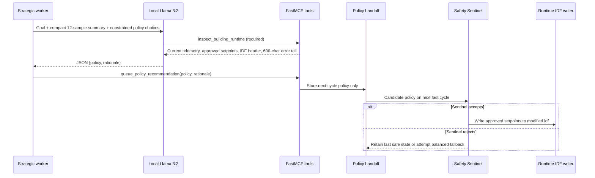
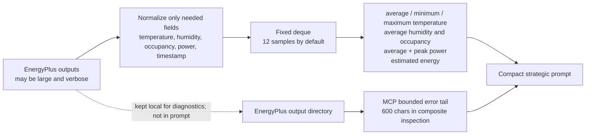
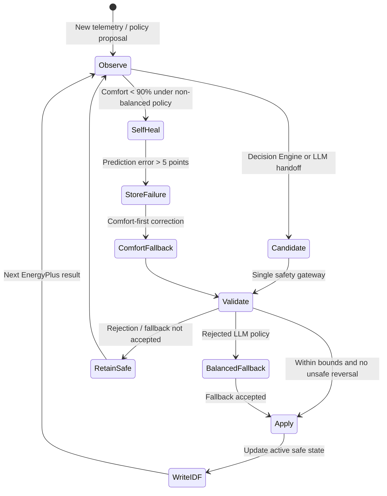
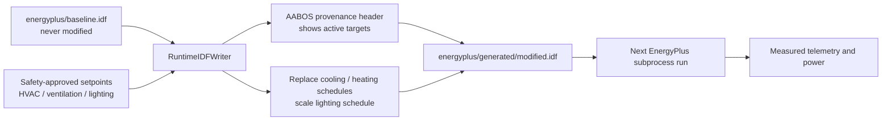
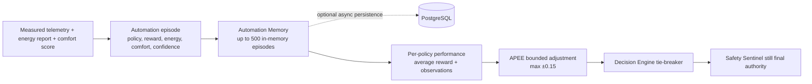
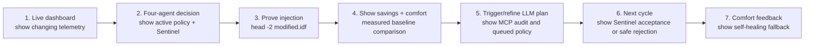

# AABOS System Architecture

## 1. Executive summary

**AABOS (Autonomous Adaptive Building Operating System)** is a safety-governed, closed-loop building-control proof of concept. It uses a real **EnergyPlus** run as its digital twin, streams normalized telemetry through **Kafka**, evaluates it with four deterministic specialist agents, and writes approved setpoints into a runtime-generated EnergyPlus model. A local open-source **Llama 3.2** model, served through **Ollama**, acts as an asynchronous strategic reasoning layer and uses governed **MCP** tools to inspect the live building state before it can recommend a policy.

The central design decision is intentional separation of concerns:

- **Fast path:** telemetry, four agents, policy arbitration, Safety Sentinel, and runtime IDF injection execute deterministically on every control cycle.
- **Strategic path:** the LLM runs only for a meaningful event, a new goal, or a periodic review. Its latency never blocks the fast path.
- **Safety boundary:** neither an agent, an API request, nor an LLM can write controls directly to EnergyPlus. Every proposed setpoint goes through the same Safety Sentinel and control gateway.

This produces a verifiable loop rather than a dashboard-only architecture:

> **EnergyPlus output → telemetry → autonomous decision → safety validation → `modified.idf` → next EnergyPlus result → measured energy/comfort feedback.**

## 2. Design goals and implementation commitments

| Design goal | How AABOS implements it | Evidence in the repository |
| --- | --- | --- |
| Physics-based building behaviour | EnergyPlus is executed as a subprocess and its output is parsed into temperature, humidity, occupancy, and electrical power telemetry. | [`app/simulation/energyplus_runner.py`](app/simulation/energyplus_runner.py) |
| Continuous autonomous control | Every simulation cycle invokes deterministic agents, policy arbitration, and the safety gateway. | [`app/services/autonomous_control.py`](app/services/autonomous_control.py) |
| Open-source AI reasoning | Local `llama3.2:3b` is called through Ollama for supervisory policy selection. | [`app/services/ollama_client.py`](app/services/ollama_client.py) |
| MCP tool use, not ungoverned prompting | The LLM must first call `inspect_building_runtime`; its next action is only a policy handoff. | [`app/mcp/server.py`](app/mcp/server.py) |
| No real-time prompt-latency risk | LLM work is placed on a background queue and consumes a bounded telemetry summary. | [`app/services/strategic_worker.py`](app/services/strategic_worker.py) |
| Safe, bounded intervention | One Safety Sentinel validates every actuator-adjacent write, including REST, MCP, autonomous, LLM, and recovery paths. | [`app/services/control_gateway.py`](app/services/control_gateway.py) |
| Quantified savings | Baseline and actual EnergyPlus power are accumulated into kWh and percentage savings. | [`app/services/energy_efficiency.py`](app/services/energy_efficiency.py) |
| Self-correction | A comfort prediction error stores a failed episode and attempts a Safety Sentinel-governed comfort fallback. | [`app/services/self_healing.py`](app/services/self_healing.py) |

## 3. End-to-end architecture

```mermaid
flowchart LR
    subgraph PHYSICS["Physics / simulation boundary"]
        BASE["baseline.idf\nimmutable reference"]
        EPLUS["EnergyPlus digital twin\nsubprocess"]
        OUTPUT["EnergyPlus output files\nSQL/CSV results"]
        IDF["generated/modified.idf\ncurrent approved configuration"]
        BASE --> IDF
        IDF --> EPLUS
        EPLUS --> OUTPUT
    end

    subgraph STREAM["Telemetry and operational state"]
        RUNNER["EnergyPlus runner\nnormalizes result"]
        TOPIC[("Kafka topic\naabos.telemetry")]
        CONSUMER["Kafka telemetry consumer"]
        STATE["Shared building state\nlatest telemetry + setpoints"]
        WINDOW["Fixed sliding window\n12 recent samples by default"]
        OUTPUT --> RUNNER --> TOPIC --> CONSUMER --> STATE
        STATE --> WINDOW
        RUNNER -. "Kafka unavailable: direct safe delivery" .-> STATE
    end

    subgraph FAST["Fast deterministic control loop — every simulation cycle"]
        AGENTS["Four specialist agents\nComfort | Energy | Occupancy | Carbon"]
        DECISION["Decision Engine\nscored policy arbitration"]
        SENTINEL["Safety Sentinel\nhard bounds + anti-oscillation"]
        GATEWAY["Single control gateway"]
        WRITER["Runtime IDF writer"]
        STATE --> AGENTS --> DECISION --> SENTINEL --> GATEWAY --> WRITER --> IDF
    end

    subgraph STRATEGY["Slow strategic reasoning — event driven and asynchronous"]
        AGMS["AGMS\nnew goal / major event / periodic review"]
        QUEUE["Strategic work queue\nbackground thread"]
        OLLAMA["Local Llama 3.2\nvia Ollama"]
        MCP["FastMCP server\nread-only runtime inspection"]
        HANDOFF["Latest-policy handoff\nnext cycle only"]
        WINDOW --> AGMS --> QUEUE --> OLLAMA
        OLLAMA <--> MCP
        OLLAMA --> HANDOFF --> SENTINEL
    end

    subgraph EVIDENCE["Evidence, learning, and UI"]
        ENERGY["Measured baseline vs actual\nkWh and savings percentage"]
        MEMORY["Automation Memory + APEE\nbounded reward tie-breaker"]
        HEAL["Self-Healing Loop\ncomfort failure → safe fallback"]
        API["FastAPI API + WebSocket"]
        DASH["React dashboard"]
        STATE --> ENERGY
        STATE --> HEAL
        STATE --> API --> DASH
        ENERGY --> MEMORY --> DECISION
        HEAL --> SENTINEL
    end
```



### 3.1 Component responsibilities

| Component | Responsibility | What it deliberately does **not** do |
| --- | --- | --- |
| EnergyPlus runner | Writes the currently approved runtime IDF, runs EnergyPlus, extracts normalized telemetry, and retries future cycles after a transient simulation failure. | It does not choose a policy. |
| Kafka producer/consumer | Decouples the simulation producer from state processing with the `aabos.telemetry` topic and a retrying consumer. | Kafka unavailability does not stop building control; the runner falls back to direct state delivery. |
| Shared building state | Holds the latest telemetry and the current safety-approved setpoints for the UI, agents, MCP resources, and runner. | It does not decide whether a change is safe. |
| Four agents + Decision Engine | Produce explainable policy recommendations and arbitrate a single candidate policy. | They cannot actuate equipment. |
| Safety Sentinel + control gateway | Validates every setpoint proposal and is the only actuator-adjacent write route. | It does not call an LLM or infer building policy. |
| Strategic worker + Ollama | Performs slower supervisory reasoning from compact evidence. | It cannot modify an IDF or bypass safety checks. |
| FastMCP server | Gives the LLM standardized, auditable runtime inspection and a policy handoff capability. | It does not expose an unguarded `write IDF` action. |
| Automation Memory / APEE | Stores observed outcomes and applies only a bounded reward-based tie-breaker to close policy votes. | It is not a trained foundation model and cannot override physical safety. |

## 4. Fast closed-loop execution

The fast path is the actual building-control loop. It runs on every EnergyPlus cycle whether or not the LLM is available, thinking, slow, or disabled.



### 4.1 The four fast agents

The agents are small, deterministic domain specialists. They make the core path explainable and avoid asking a generative model to respond to every telemetry tick.

| Agent | Reads primarily | Typical recommendation | Why it is separate |
| --- | --- | --- | --- |
| Comfort Agent | Zone temperature and humidity | `comfort_first` when conditions leave the comfort target | Comfort cannot be accidentally traded away for a weak energy opportunity. |
| Energy Agent | Electrical power | `energy_saver` under material demand | Keeps energy reasoning transparent and measurable against baseline. |
| Occupancy Agent | Occupancy percentage | Reduced intensity at low demand; balanced service otherwise | Avoids conditioning and lighting an unoccupied building at full intensity. |
| Carbon Agent | Power plus available carbon-intensity context | `carbon_aware` when the relevant signal is available | Keeps carbon objectives explicit instead of hiding them in an energy score. |

The Decision Engine scores each policy recommendation, reduces the weight of a default `balanced` vote, and selects one policy. It may add a small, bounded preference from Automation Memory only to break close decisions. Agent evidence and the Safety Sentinel remain authoritative.

### 4.2 Policy-to-setpoint translation

The current implementation uses a small, auditable policy vocabulary rather than allowing arbitrary LLM numbers. HVAC, ventilation, and lighting remain governed active-control targets; the baseline model's physical HVAC and lighting schedules are materialized by the current runtime writer.

| Policy | HVAC target | Ventilation | Lighting | Intended operating mode |
| --- | ---: | ---: | ---: | --- |
| `balanced` | 22.0 °C | 50% | 100% | Default stable service. |
| `energy_saver` | 24.0 °C | 35% | 70% | Reduce energy within the occupied comfort band. |
| `comfort_first` | 22.0 °C | 65% | 100% | Recover from comfort degradation. |
| `carbon_aware` | 23.5 °C | 40% | 75% | Supervise energy/carbon-sensitive operation. |

The mapping is defined in [`app/services/decision_engine.py`](app/services/decision_engine.py). This policy-first interface is important: it constrains LLM output, makes the audit trail understandable, and ensures every recommendation maps to a known, testable configuration.

## 5. Why Kafka is in the architecture

Kafka is not used as a decorative dependency. It gives AABOS a fault-isolated streaming boundary between an EnergyPlus run that produces data and services that consume it.



### 5.1 Benefits delivered by the current implementation

1. **Producer-consumer decoupling.** EnergyPlus telemetry is emitted as a normalized `BuildingTelemetry` event. The consumer updates operational state in a separate background thread, so the simulator does not need to know dashboard, aggregation, or API details.
2. **Fault isolation and recovery.** The consumer retries after Kafka exceptions. If a local broker is unavailable, the runner still updates shared state, energy accounting, and the sliding window directly. Loss of Kafka therefore reduces decoupling, not building safety.
3. **Event replay-ready boundary.** The topic provides a natural place to add independent consumers such as long-term storage, anomaly detection, or a second building-zone service without changing the EnergyPlus wrapper.
4. **Compact transport contract.** The current topic carries typed normalized values rather than EnergyPlus text logs. This keeps message routing lightweight and prevents downstream services from parsing simulator files.

### 5.2 Current routing truth and scalable extension

The current running configuration has one configured Kafka topic: **`aabos.telemetry`**. Each fast agent reads the corresponding signal from the normalized current telemetry object in the deterministic control process; it is **logical specialization**, not four separate Kafka topics. This is the right amount of infrastructure for a single-zone PoC and prevents unnecessary inter-agent messaging latency.

For a multi-zone deployment, the same envelope can be partitioned by `building_id` / `zone_id`, or the topology can fan out into domain topics such as `telemetry.comfort`, `telemetry.energy`, and `telemetry.occupancy`. The consumer contract is deliberately isolated in [`app/kafka/telemetry_consumer.py`](app/kafka/telemetry_consumer.py), so that extension does not require changing the EnergyPlus runner or the Safety Sentinel.

## 6. Two-horizon autonomy: fast deterministic control and slow AI strategy



### 6.1 Event-driven triggers

The Autonomous Goal Management System (AGMS) generates a strategic objective when a material building transition is observed:

- **Power event:** power at or above **7 kW** queues an energy-reduction objective.
- **Comfort event:** temperature at least **1.5 °C** away from the 22 °C target, or humidity at least **65%**, queues a comfort objective.
- **Occupancy event:** occupancy at or below **20%** may queue a supervisory energy setback objective.
- **Human objective:** an operator can submit energy, carbon, or comfort goals through the API/dashboard.
- **Periodic review:** an accepted active goal is reviewed at the configurable strategic interval, **30 minutes by default**.

AGMS de-duplicates equivalent autonomous objectives for 30 minutes. This avoids repeatedly sending unchanged conditions to the LLM while still allowing immediate deterministic control every cycle.

### 6.2 Why the LLM is asynchronous

Local inference may take seconds, especially on a laptop CPU. Waiting for it inside the telemetry callback would make the entire building loop less stable. AABOS therefore uses an in-process thread-safe `StrategicWorkQueue`:

```mermaid
sequenceDiagram
    participant C as Fast control cycle
    participant Q as StrategicWorkQueue
    participant W as Background worker
    participant O as Local Ollama
    participant H as PolicyHandoffQueue
    participant S as Next fast cycle

    C->>Q: Submit event or goal; return immediately
    Note right of C: Telemetry control continues without waiting
    Q->>W: Dequeue job
    W->>O: Request strategic policy from compact evidence
    alt Valid LLM response
        O-->>W: Policy + short rationale + tool audit
        W->>H: Publish newest supervisory policy
    else Model unavailable, timeout, or invalid output
        W-->>W: Build deterministic strategic fallback plan
    end
    S->>H: Consume newest available handoff
    S->>S: Validate it with Safety Sentinel before applying
```

Only the latest recommended policy is retained for the next cycle. This avoids a stale backlog of old ideas being applied after building conditions have changed.

## 7. LLM and MCP tool-calling design

### 7.1 Governed LLM contract

The LLM is a **supervisory policy recommender**, not a direct actuator. Before it can respond, its prompt requires a call to the read-only `inspect_building_runtime` MCP tool. The application validates the actual tool-call audit; a final response without the required tool call is treated as unavailable and falls back to deterministic planning.



### 7.2 MCP resources and tools

| MCP capability | Type | Purpose | Control boundary |
| --- | --- | --- | --- |
| `building://telemetry/current` | Resource | Latest temperature, humidity, occupancy, and power. | Read-only. |
| `building://setpoints/current` | Resource | Current approved setpoints. | Read-only. |
| `get_building_context` | Tool | Returns live telemetry and active setpoints in one response. | Read-only. |
| `inspect_generated_model` | Tool | Reads a short header from the runtime-generated IDF. | Read-only. |
| `read_energyplus_runtime_errors` | Tool | Reads a bounded error-log tail for diagnosis. | Read-only; bounded length. |
| `inspect_building_runtime` | Tool | Composes the three inspection views required by the strategic prompt. | Read-only; the LLM-required evidence call. |
| `queue_policy_recommendation` | Tool | Places a named policy in the one-item next-cycle handoff. | Cannot alter a setpoint directly. |
| `set_hvac_temperature`, `adjust_ventilation`, `adjust_lighting` | Tool | Optional operator/MCP configuration interfaces. | Each routes through the same safety gateway. |

### 7.3 Prompt strategy and output constraints

The LLM prompt is deliberately small and restrictive. It tells the model that it:

- receives **rolling-window summaries**, not raw EnergyPlus files;
- must call `inspect_building_runtime` before making a recommendation;
- may choose only `balanced`, `energy_saver`, `comfort_first`, or `carbon_aware`;
- must not issue actuator commands, bypass safety rules, or modify an IDF;
- must return JSON with exactly a `policy` and one short `rationale`.

This reduces ambiguity, makes the response machine-readable, and allows the system to fail closed. The LLM's policy becomes a proposal, not an instruction.

## 8. Latency, throughput, and prompt-size optimizations

The project explicitly treats prompt latency and long simulation output as architecture problems rather than relying on a faster model alone.

| Optimization | Implementation | Why it matters |
| --- | --- | --- |
| Separate control horizons | Fast path never awaits Ollama; the strategic worker is a daemon background thread. | Live building control remains responsive during slow local inference. |
| Event-driven invocation | AGMS creates work only for meaningful state changes, a new goal, or an interval review. | Avoids paying LLM latency every simulation tick. |
| Event de-duplication | Equivalent autonomous goals are suppressed for 30 minutes. | Prevents a queue of redundant strategic requests. |
| One-item policy handoff | The handoff retains only the newest recommendation. | Prevents stale plans from being applied after conditions change. |
| LLM warm-up | Ollama receives an asynchronous warm-up request at service start. | Reduces first-interaction model-load delay without delaying API startup. |
| Model residency | Ollama `keep_alive` defaults to **30 minutes**. | Avoids repeated model loading during a demo or active monitoring period. |
| Bounded generation | Defaults: **2,048-token context**, **120 output tokens**, temperature `0`. | Keeps local responses focused, reproducible, and faster. |
| Fixed telemetry window | A deque retains **12 samples by default** and derives aggregate statistics. | Prompt cost does not increase with simulation duration. |
| Composite evidence tool | One `inspect_building_runtime` call returns context, IDF evidence, and bounded errors. | Minimizes tool round-trips and LLM context overhead. |
| Bounded log tail | Strategic inspection requests only **600 characters** of EnergyPlus error evidence. | Prevents verbose simulator logs from consuming the prompt. |
| Non-blocking persistence | Automation Memory writes asynchronously when a database is available. | Learning data does not make a control tick wait for the database. |
| Controlled retry | EnergyPlus loop records errors and retries the next cycle using the current last-safe controls. | A transient subprocess/output-directory issue does not crash the service. |

### 8.1 Bounded telemetry transformation



The aggregate statistics preserve the decision-relevant shape of recent building behaviour while bounding memory, network payload, and prompt size. Full EnergyPlus output remains available locally for debugging, but it never becomes unfiltered LLM context.

## 9. Safety model and self-correction

### 9.1 Single enforcement point

All actuator-adjacent proposals converge at `apply_safe_setpoints()` in [`app/services/control_gateway.py`](app/services/control_gateway.py). This is the key safety property: an LLM policy handoff, a fast-agent decision, an operator API action, an MCP setpoint request, and a self-healing correction all pass the same validator.

The Safety Sentinel enforces:

| Guardrail | Current rule |
| --- | --- |
| HVAC move magnitude | Maximum **2.0 °C** per proposal. |
| Ventilation move magnitude | Maximum **25 percentage points** per proposal. |
| Lighting move magnitude | Maximum **30 percentage points** per proposal. |
| Oscillation prevention | Reject a reversal within **5 minutes** of an accepted change, except emergency recovery. |
| Rejection behaviour | Preserve last known safe setpoints; a rejected LLM policy may attempt the safe `balanced` fallback. |



### 9.2 Self-Healing Loop

Self-healing is feedback correction, not a claim that every policy succeeds. When expected comfort exceeds actual comfort by more than **5 points**, AABOS:

1. records the failed policy and a negative reward in Automation Memory;
2. calculates a bounded `comfort_first` recovery proposal;
3. revalidates it through the Safety Sentinel, using emergency recovery semantics only for the correction path;
4. applies it only if accepted, then makes it the next runtime-model configuration;
5. otherwise retains safe current controls and records that correction was blocked.

The autonomous loop also checks measured comfort on each cycle. If a non-balanced policy falls below the configured minimum comfort score (**90% by default**), it invokes this self-healing path automatically.

## 10. Runtime EnergyPlus injection



`RuntimeIDFWriter` starts from the immutable baseline and atomically replaces the generated file. It:

- writes an explicit header containing the approved HVAC, ventilation, and lighting targets;
- updates the cooling schedule (`CLGSETP_SCH`);
- updates the heating schedule (`HTGSETP_SCH`) to HVAC target minus 2 °C, bounded at 16 °C;
- scales the building lighting schedule (`BLDG_LIGHT_SCH`);
- writes a temporary file and then replaces `modified.idf`, avoiding a partially-written model.

**Implementation detail:** the present PoC physically updates the baseline HVAC and lighting schedules. Ventilation is still a safety-governed active target and is recorded in the generated-model provenance header, but the standard baseline's `MinOA_Sched` is currently retained. Mapping that target to the outdoor-air schedule is a clearly isolated next model-writer enhancement; it does not change the governed control, telemetry, LLM, or safety architecture described above.

The runtime-generated file is a deliverable and a practical audit artifact. During a demonstration, this command shows the exact configuration that will affect the next EnergyPlus evaluation:

```bash
head -2 energyplus/generated/modified.idf
```

## 11. Measurement, savings, and bounded learning

### 11.1 Realized-energy accounting

Savings are not inferred by the LLM. The `EnergyEfficiencyTracker` captures a balanced baseline power value and then accumulates both baseline-equivalent and actual EnergyPlus energy for each simulation interval:

```text
baseline_energy_kWh = baseline_power_kW × elapsed_hours
actual_energy_kWh   = measured_EnergyPlus_power_kW × elapsed_hours
savings_%           = (baseline_energy - actual_energy) / baseline_energy × 100
```

The dashboard displays baseline power, cumulative baseline kWh, actual kWh, energy saved in kWh, and percentage savings. A verified same-period comparison measured **22.04 kW** baseline and **17.50 kW** under Energy Saver: **20.6% lower power**, with the selected temperature still inside the occupied 20–24 °C comfort band.

### 11.2 Automation Memory and APEE



This is **not** offline reinforcement-learning model training. AABOS uses a local pretrained LLM for strategy and a lightweight, reward-guided online preference mechanism for policy adaptation. APEE can only add a bounded adjustment (maximum ±0.15) to a policy score; it cannot select unsafe setpoints, overpower new telemetry, or override the Safety Sentinel.

## 12. Fault tolerance and degraded modes

| Failure or abnormal condition | AABOS behaviour | Safety outcome |
| --- | --- | --- |
| Kafka is unavailable | The runner directly updates shared state, energy tracking, and the telemetry window; the consumer separately retries. | Control continues with less decoupling, not less safety. |
| EnergyPlus cycle fails | The background loop records the error and retries the next cycle using the current last-safe controls. | Backend remains alive instead of crashing the API. |
| Ollama is disabled, slow, unavailable, or produces invalid output | The strategic worker produces a deterministic plan and no LLM handoff is applied. | Fast autonomous control continues. |
| LLM omits mandatory runtime inspection | The client rejects the LLM result as unavailable. | No uninspected model response reaches control. |
| An LLM/agent/API proposal exceeds safety constraints | Sentinel rejects it; last-safe setpoints remain active or a validated balanced fallback is attempted. | Unsafe movement is not written to the runtime IDF. |
| Measured comfort falls below threshold | Self-Healing Loop stores failure and attempts a validated comfort-first correction. | The controller recovers rather than repeating a poor policy. |
| Optional database persistence fails | Automation Memory remains in-memory and logs the persistence issue. | No impact on the real-time control path. |

## 13. Observability and judge-facing evidence

The dashboard and APIs make the control chain inspectable rather than requiring a judge to trust internal logs.

| What to observe | Evidence shown | Meaning |
| --- | --- | --- |
| Live simulation | Temperature, humidity, occupancy, power, and changing timestamp | EnergyPlus is producing active telemetry. |
| Autonomous decision | Four agent recommendations, confidence, active policy, and action message | The fast path is deciding without manual code changes. |
| Safety gate | Approved/rejected action text and fallback status | A policy cannot silently bypass constraints. |
| LLM/MCP audit | Local Llama model, `inspect_building_runtime`, `queue_policy_recommendation`, policy, and rationale | Strategic reasoning used governed tools. |
| Runtime injection | Current active setpoints plus `modified.idf` header | Approved controls are carried to EnergyPlus. |
| Quantitative outcome | Baseline, actual energy, savings kWh/%, and comfort score | Efficiency is measured against comfort rather than claimed. |
| Correction behaviour | Policy failure message, prediction error, and `comfort_first` fallback | Bad outcomes produce automatic recovery and learning. |

### 13.1 Recommended three-minute demo path



This sequence visibly demonstrates the required closed loop: telemetry changes, a control decision occurs, controls are injected back into EnergyPlus, the next result changes, and a bad outcome is corrected.

## 14. Implementation map

```text
app/
├── simulation/
│   ├── energyplus_runner.py    EnergyPlus subprocess, output parsing, retries, telemetry publishing
│   ├── idf_writer.py           Baseline-to-runtime generated IDF update
│   └── state.py                Latest telemetry and approved setpoints
├── kafka/
│   ├── client.py               Safe producer and broker connectivity check
│   └── telemetry_consumer.py   Retry-capable background consumer
├── agents/
│   └── specialized.py          Comfort, Energy, Occupancy, Carbon agent logic
├── services/
│   ├── autonomous_control.py   Fast loop, event submission, LLM handoff integration
│   ├── decision_engine.py      Policy arbitration and setpoint catalogue
│   ├── safety_sentinel.py      Bounds and anti-oscillation rules
│   ├── control_gateway.py      One mandatory setpoint-application gateway
│   ├── strategic_worker.py     Background strategic queue and deterministic fallback
│   ├── ollama_client.py        Local LLM prompt, tool-call enforcement, bounded response
│   ├── telemetry_aggregation.py Sliding-window summary
│   ├── goal_management.py      AGMS goals, event triggers, de-duplication
│   ├── self_healing.py         Comfort feedback correction
│   ├── automation_memory.py    Episode store and optional asynchronous persistence
│   └── adaptive_policy.py      Bounded reward-guided policy preference
├── mcp/server.py               MCP resources and governed tools
└── api/routes/                 FastAPI endpoints consumed by the dashboard

energyplus/
├── baseline.idf                Immutable base EnergyPlus model
└── generated/modified.idf      Runtime-generated approved model
```

## 15. Reproducibility and operating guidance

The complete clone-and-run procedure, prerequisite versions, Docker/Kafka startup, Ollama installation, EnergyPlus path configuration, backend command, dashboard command, and test commands are documented in the repository [`README.md`](README.md).

For a judge or developer, the essential runtime conditions are:

1. Start Kafka and PostgreSQL with `docker compose up -d`.
2. Run the local model with `ollama serve` (if needed) and `ollama pull llama3.2:3b`.
3. Configure the installed EnergyPlus executable, base model, and weather file through environment variables.
4. Start FastAPI with `SIMULATION_ENABLED=true` and start the React dashboard separately.
5. Wait for a few EnergyPlus cycles before interpreting cumulative savings.

## 16. Scope and honest boundaries

- AABOS uses a local pretrained open-source LLM; it does **not** claim to train a custom foundation model.
- Its learning layer is bounded online policy preference adaptation, not unconstrained RL exploration.
- Carbon policy is represented in the policy/goal architecture and can consume carbon-intensity context supplied to the decision path; the current single-zone PoC prioritizes EnergyPlus-measured energy and comfort evidence.
- Kafka currently transports a normalized telemetry topic for the single-zone PoC. Topic-per-domain or topic-per-zone fan-out is a deployment-scale extension, not a claim about the current message topology.
- The LLM is intentionally denied direct actuation. This reduces the blast radius of hallucination and makes a safe rejection a successful control outcome, not a system failure.

## 17. Conclusion

AABOS is built around an inspectable, physical-AI feedback loop. EnergyPlus remains the source of truth for building physics and measured outcomes; deterministic specialists make rapid decisions; Kafka separates telemetry production from processing; a local LLM contributes event-driven strategic reasoning through MCP; and the Safety Sentinel mediates every control write. The result is a system that can optimize, measure, explain, recover, and keep operating even when the slower AI or infrastructure layers are unavailable.
